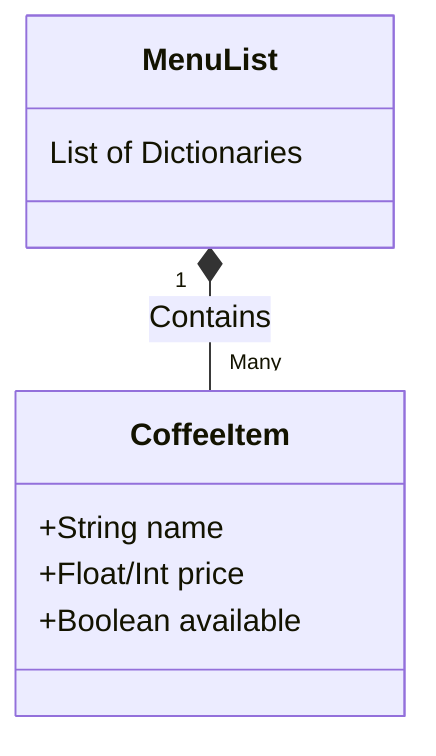
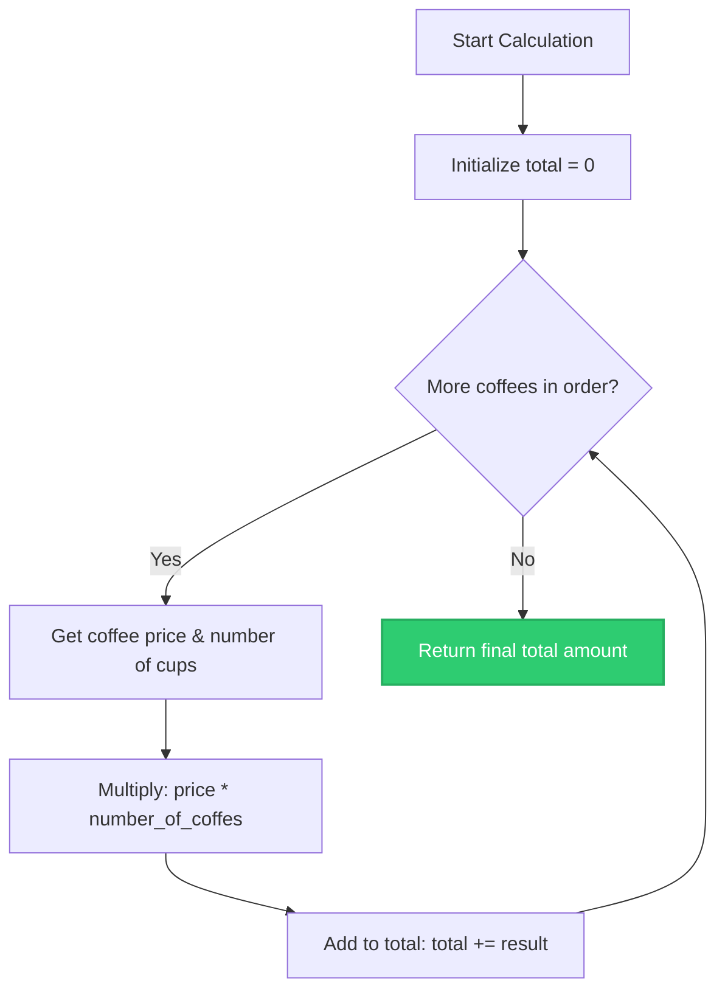
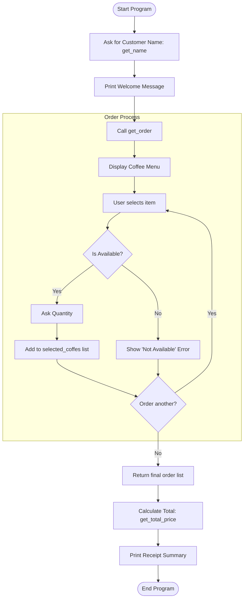

¡Tienes toda la razón! Disculpa por la redundancia. Si el código completo ya vive en los archivos de tu repositorio, el documento Markdown (como un `README.md` o wiki) debe enfocarse exclusivamente en la teoría, la arquitectura y los diagramas de flujo para no duplicar información.

Aquí tienes la versión ajustada y extendida en inglés, **sin el bloque de código completo**, enfocada puramente en documentar la lógica y el flujo del sistema:

***

```markdown
# ☕ Programming Solutions for a Small Café: The Digital Barista

## 1. What Is Programming and Why It Matters for the Café

Programming can be seamlessly compared to a coffee recipe: just as a barista follows a precise set of steps to prepare a perfect cappuccino, a computer follows a set of instructions (a program) to process information. If a café owner can digitise the tasks of taking orders and balancing the register, the business gains massive advantages:

*   **Flawless Accuracy:** Automatic calculations eliminate human errors when totalling orders, ensuring every cent is accounted for.
*   **Operational Speed:** Orders are registered and totals are computed instantly, keeping the queue moving fast.
*   **Inventory & Popularity Tracking:** Knowing exactly *how much* of *which* coffee is selling helps with restocking and menu curation.
*   **Strategic Insights:** Data collected over time reveals peak operational hours, popular seasonal products, and shifting customer preferences, allowing management to make data-driven decisions.

In short, a program turns the manual, repetitive task of recording orders into an automated, reliable digital engine.

---

## 2. Fundamental Programming Concepts – Café Style

Using the café as an educational analogy, we can easily break down how programming works under the hood.

### 🍵 Variables (The Cups)
To prepare a coffee, you need a cup to hold the liquid so you can manipulate it. In programming, a variable is our "cup". You give it a label (a name) and store information inside it to use later (e.g., `cappuccino_price = 3.50`).

### 🥛 Data Types (The Ingredients)
Different kinds of drinks require different ingredients. Similarly, programming uses different **Data Types** to handle different kinds of information:
*   **Integer (`int`):** Whole numbers. Used for counting items that can't be divided, like the number of cups (`quantity = 2`).
*   **Float (`float`):** Decimal numbers. Perfect for money, as prices often include cents (`price = 4.75`).
*   **String (`str`):** Text characters strung together. Used for naming things, like the customer's name or the coffee's name (`item = "Latte"`).
*   **Boolean (`bool`):** A simple `True` or `False`. Used for binary states, like whether an item is currently in stock (`is_available = True`).

### ⚖️ Expressions and Operators (Mixing & Proportions)
If combining two ingredients achieves a specific result, we have the equivalent of an **expression**. The proportions (addition, subtraction, multiplication) are handled by **operators**:
*   **Arithmetic operators:** `*` (multiply), `+` (add), `-` (subtract), `/` (divide).
*   **Assignment operators:** `=` assigns a value to a variable. `+=` is a shortcut that adds a new value to the existing one (e.g., accumulating a running total).

### 🔀 Control Flow (Making Decisions)
Control flow is the decision-making process. It’s the digital equivalent of asking a customer, *"Do you want sugar?"*. If they say yes, the program executes a specific action. Control flow also includes **Loops** (`for`, `while`), which let us repeat steps—perfect for taking multiple items in a single order until the customer says they are done.

---

## 3. Storing Menu Items: Data Structures

To represent our menu programmatically, we group the details of a single coffee (name, price, availability) into a **Dictionary** (`dict`). A dictionary uses "keys" to find "values", keeping related data neatly packaged.

To group *all* our coffees together, we place these dictionaries inside a **List** (or a Tuple). A list is flexible, allowing us to iterate (loop) through the entire menu easily when presenting it to the customer.

### 📊 Menu Data Structure Architecture
*This diagram illustrates how the main List holds multiple Dictionaries, each representing a distinct coffee item.*



---

## 4. Calculating the Total Cost: Accumulation Logic

When a customer orders multiple items, the program relies heavily on arithmetic and assignment operators. 

1. We set a starting `total` to `0`. 
2. We loop through every coffee ordered. 
3. We multiply the coffee's `price` by the `quantity` of cups.
4. We use the `+=` assignment operator to append that result to our running `total`.

### 🧮 Order Calculation Flow
*Visual representation of the loop used to generate the final receipt.*



---

## 5. Overall Program Execution Flow

The system is divided into modular **Functions** (blocks of reusable code). Below is the overarching architecture of how these functions interact with the user to process a full transaction—from greeting the customer to printing the final receipt.

### 🗺️ System Interaction (Main Flow)



---

## 6. References

*   **Python Software Foundation.** (2023). *Built-in Types*. Retrieved from https://docs.python.org/3/library/stdtypes.html
*   **Severance, C. R.** (2016). *Python for Everybody: Exploring Data in Python 3*. Retrieved from https://www.py4e.com/book.php

*(Note: This document effectively bridges the gap between everyday café operations and computer science logic by explaining fundamental data types, assignment operators, and control flow tools.)*
```
